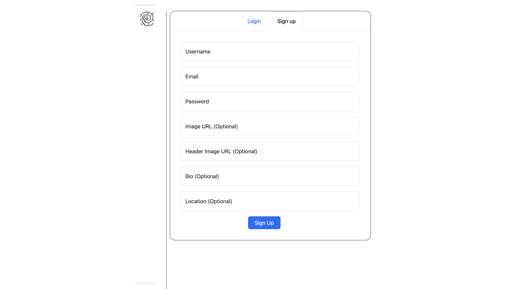
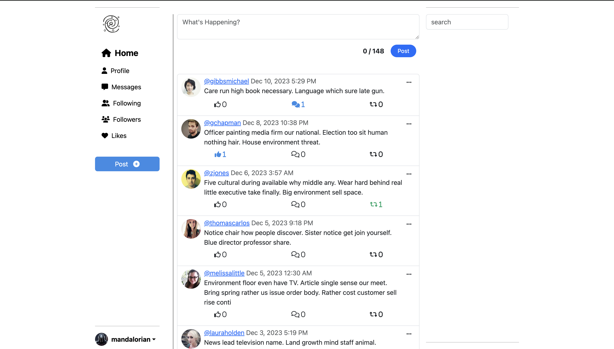
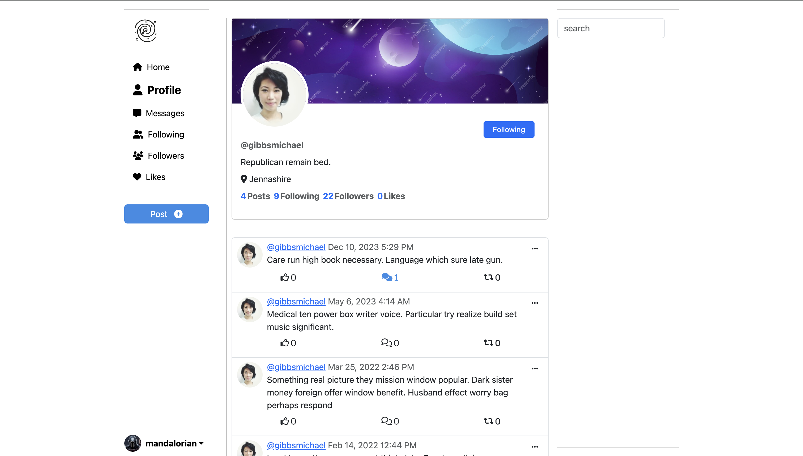
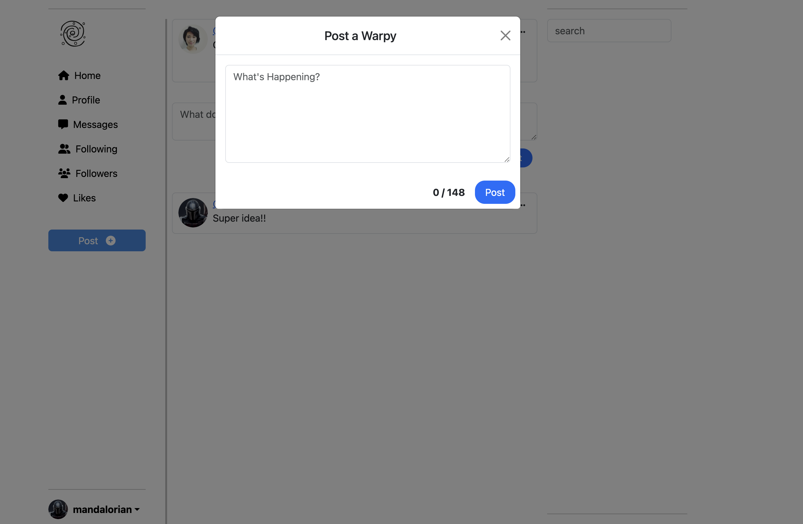
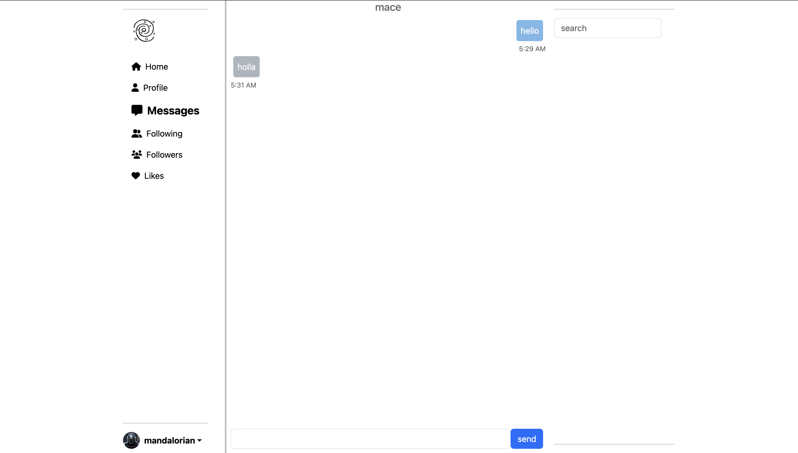

# Warp Social Media Platform

Warp is an innovative and user-friendly social media platform designed to connect people, share experiences, and foster meaningful interactions. Whether you're a user looking to engage with others or a developer seeking to contribute, this README will guide you through essential information about [Warp](https://warp-95c2.onrender.com).
<br>\






## Table of Contents

- [Features](#features)
- [Getting Started](#getting-started)
  - [Prerequisites](#prerequisites)
  - [Installation](#installation)
- [Usage](#usage)
- [Contributing](#contributing)
- [Support](#support)
- [License](#license)

## Features

- **User-friendly Interface:** Enjoy a seamless and intuitive user experience.
- **Real-time Messaging:** Connect with friends through instant messaging.
- **Privacy Controls:** Customize your privacy settings for a secure experience.

## Getting Started

### Prerequisites

Before you begin, ensure you have met the following requirements:

- python3
- flask


### Installation

1. Clone the repository:

    ```bash
    git clone https://github.com/mbouanik/warp.git
    cd warp
    ```

2. Install dependencies:

    ```bash
    pip install -r requirements.txt
    ```

3. Configure environment variables:

    Create a `.env` file in the root directory and set the following variables:

    ```env
    DATABASE_URI="database uri"
    SECRET_KEY="your_session_secret"
    SENDGRID_API_KEY="api key"

    ```

4. Start the application:

    ```bash
    python3 app.py
    ```
5. Test the application test are written using unittest:

    ```bash
    python3  -m unittest -v test/test_app.py
    ```
Visit `http://localhost:5000` in your browser to access Warp.

## Usage

- Create an account or log in if you already have one.
- Explore the platform features, post updates, and connect with others.
- Customize your profile.

## Contributing

Contributions are welcome! To contribute to Warp, follow these steps:

1. Fork the repository.
2. Create a new branch: `git checkout -b feature/your-feature`.
3. Make your changes and commit: `git commit -m 'Add some feature'`.
4. Push to the branch: `git push origin feature/your-feature`.
5. Submit a pull request.

For major changes, please open an issue first to discuss potential modifications.

## Support

If you encounter any issues or have questions, feel free to reach out to our support team at [warpalone@gmail.com](warpalone@gmail.com).

## License

This project is licensed under the [MIT License](LICENSE).
 
